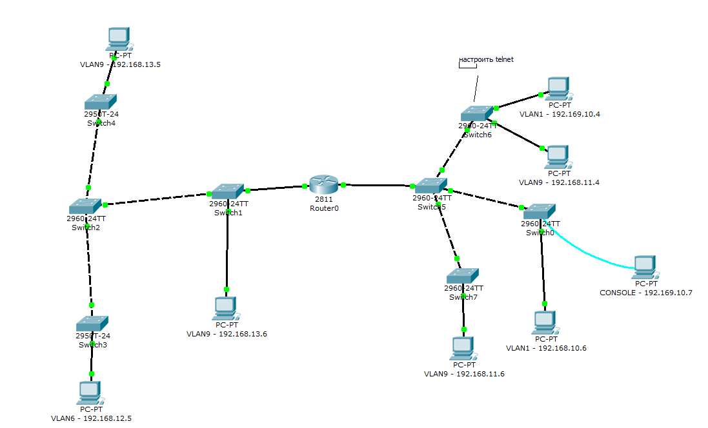
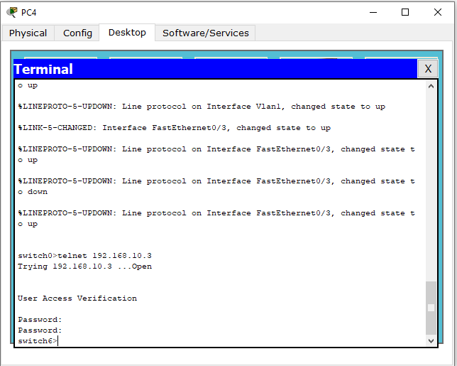

# Лабораторная работа 1 "Начальное конфигурирование" и "Виртуальные локальные сети"

## Топология

## Вопросы

Конфигурация:
1. Перечислите способы подключения к маршрутизатору с целью конфигурирования?
2. В чем заключается различие между паролями password и secret?
3. Где хранится текущая конфигурация коммутатора?
4. Где хранится загрузочная конфигурация коммутатора?

VLAN:
1. Что такое VLAN? Зачем нужен?
2. Когда кадр тегируется и когда снимается тег определенного vlan?
3. Каким образом происходит определение, какому VLAN предназначается трафик?

Еще:
1. Почему  первый icmp-пакет валится?
2. Что такое ARP? Зачем?

## Защита

Через компьютер, который подключен консольным проводом к коммутатору, подключиться к telnet на switch

